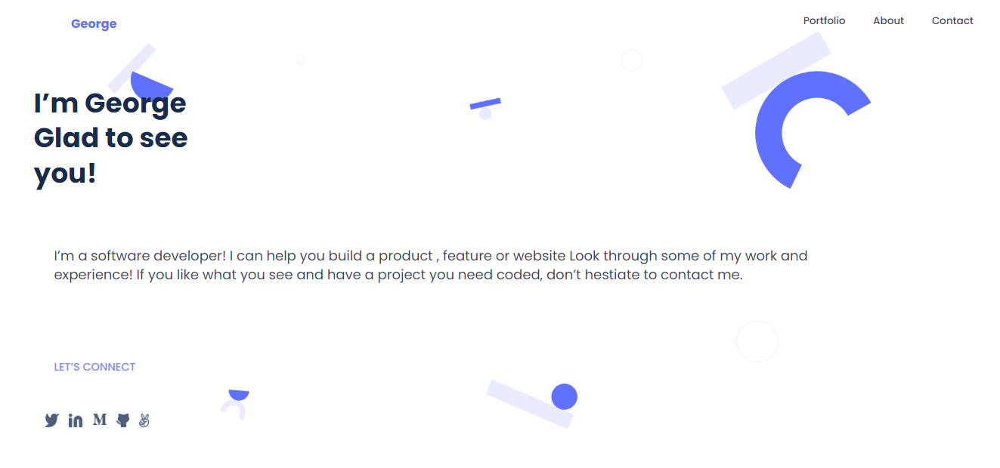

<a name="readme-top"></a>

<div align="center">
  <!-- You are encouraged to replace this logo with your own! Otherwise you can also remove it. -->
  
  <br/>

  <h3><b>George Kinyanjui</b></h3>

</div>

# 📗 Table of Contents

- [📖 About the Project](#about-project)
  - [🛠 Built With](#built-with)
    - [Tech Stack](#tech-stack)
    - [Key Features](#key-features)
  - [🚀 Live Demo](#live-demo)
- [💻 Getting Started](#getting-started)
  - [Setup](#setup)
  - [Prerequisites](#prerequisites)
  - [Usage](#usage)
  - [Deployment](#deployment)
- [👥 Authors](#authors)
- [🤝 Contributing](#contributing)
- [⭐️ Show your support](#support)
- [🙏 Acknowledgements](#acknowledgements)
- [📝 License](#license)

<!-- PROJECT DESCRIPTION -->

# 📖 [My Portfolio] <a name="about-project"></a>

**[My Portfolio]**  presents my background, projects that I implemented, the tools and languages I worked with. Generally it presents me as a software developer.

## 🛠 Built With <a name="built-with"></a>

### Tech Stack <a name="tech-stack"></a>

<details>
  <summary>Client</summary>
  <ul>
    <li><a href="https://www.javascript.com/">JavaScript</a></li>
  </ul>
</details>

<!-- Features -->

### Key Features <a name="key-features"></a>

- **[See my projects]**
- **[Can contact me ]**
- **[Can view all my socials ]**

<p align="right">(<a href="#readme-top">back to top</a>)</p>

<!-- LIVE DEMO -->

## 🚀 Live Demo <a name="live-demo"></a>


- [Live Demo Link](https://george827.github.io/My-Portfolio/)

<p align="right">(<a href="#readme-top">back to top</a>)</p>

<!-- GETTING STARTED -->

## 💻 Getting Started <a name="getting-started"></a>

To get a local copy up and running, follow these steps.

### Prerequisites

In order to run this project you need:

To have a computer and any code editor.

### Setup

Clone this repository to your desired folder:

```sh
  cd my-folder
  git clone https://github.com/george827/My-Portfolio.git
```


### Usage

To run the project, execute the following command:

- Open the `index.html` with your browser

### Deployment

You can deploy this project using:

-You can deploy using the github pages or web service like render

<p align="right">(<a href="#readme-top">back to top</a>)</p>

<!-- AUTHORS -->

## 👥 Authors <a name="authors"></a>

👤 **George kinyanjui**

- GitHub: [@george827](https://github.com/george827)
- Twitter: [@geok8376](https://twitter.com/geok8376)
- LinkedIn: [George Kinyanjui](https://www.linkedin.com/in/georgekinyanjui/)

👤 **Faisher**

- GitHub: [@Robison-faike123](https://github.com/Robison-faike123)

<p align="right">(<a href="#readme-top">back to top</a>)</p>

<!-- CONTRIBUTING -->

## 🤝 Contributing <a name="contributing"></a>

Contributions, issues, and feature requests are welcome!

Feel free to check the [issues page](https://github.com/george827/My-Portfolio/issues).

<p align="right">(<a href="#readme-top">back to top</a>)</p>

<!-- SUPPORT -->

## ⭐️ Show your support <a name="support"></a>


If you like this project you can leave a star ⭐️

<p align="right">(<a href="#readme-top">back to top</a>)</p>

<!-- ACKNOWLEDGEMENTS -->

## 🙏 Acknowledgments <a name="acknowledgements"></a>


I would like to thank Microverse for the learning materials provided and the supporting community

<p align="right">(<a href="#readme-top">back to top</a>)</p>


<!-- LICENSE -->

## 📝 License <a name="license"></a>

This project is [MIT](https://github.com/george827/My-Portfolio/blob/dev/LICENSE) licensed.

<p align="right">(<a href="#readme-top">back to top</a>)</p>